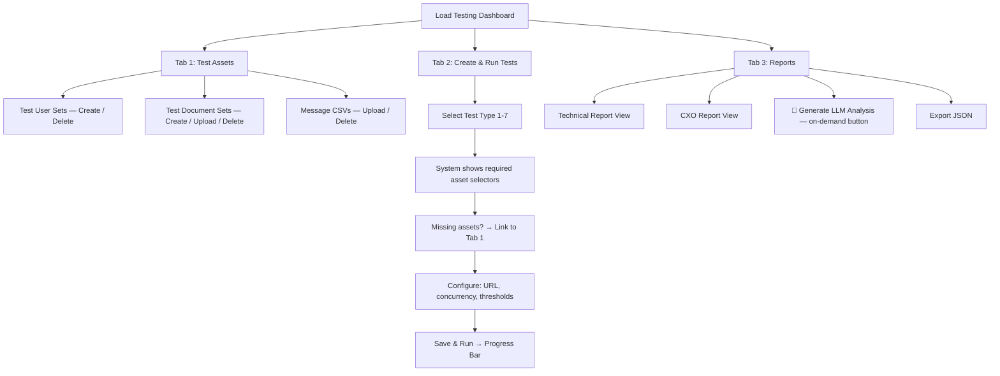

# Load Testing System for Iqbal AI Admin Panel

A comprehensive load testing framework integrated into the admin panel that tests critical user flows against any environment, measures performance bottlenecks, and generates dual-format reports (Technical + CXO) with on-demand LLM analysis.

## Architecture

- **`aiohttp` + `asyncio`** — lightweight true-concurrency HTTP client, no external tools
- **Hits remote server via HTTP** — tests full stack (nginx → Flask → Celery → DB → LLM)
- **Dynamic target URL** — admin selects: `localhost` (for dev), `staging`, `production`, or custom URL
- **Admin-managed test assets** — user sets, document sets, message CSVs — all fully deletable from the listing UI
- **Dual reports** — Technical (engineering) + CXO (executives), with **on-demand LLM analysis** (button on report page, not during test run)
- **Comprehensive failure diagnostics** — every failure captures: step name, error type, HTTP status, response body, stack trace if returned, logs, and suggested solutions

> [!IMPORTANT]
> Default URLs: `http://localhost:5000` (dev), `https://staging.iqbalai.com` (staging). Admin can enter any custom URL.

---

## Admin UI Flow



---

## Global Settings & Remote Asset Management

To support testing against multiple environments (Local, Staging, Prod), the Admin UI will feature a **Global Settings** tab.
- **Target Environment URL**: Definitive source for where tests run AND where assets are managed.
- **Admin API Key**: Required to authenticate against remote environments when managing assets.
- **Asset Fetching**: The UI will dynamically fetch User/Document sets from the configured Target URL (via a local proxy to avoid CORS), ensuring the test data matches the target environment.

---

## Proposed Changes

### New Module: `app/load_testing/`

#### [NEW] [\_\_init\_\_.py](file:///Users/abdurrehman/Documents/GitHub/iqbal_ai_stg/app/load_testing/__init__.py)

#### [NEW] [config.py](file:///Users/abdurrehman/Documents/GitHub/iqbal_ai_stg/app/load_testing/config.py)

Dataclasses: `LoadTestConfig` (target URL, concurrency, timeout, thresholds), `TestScenarioConfig` (test type, asset IDs, ramp-up steps).

#### [NEW] [runner.py](file:///Users/abdurrehman/Documents/GitHub/iqbal_ai_stg/app/load_testing/runner.py)

Core async execution engine:
- **Concurrent mode**: `asyncio.gather()` with N sessions, each with cookie jar for Flask session persistence
- **Sequential mode**: single session, one-by-one requests with per-request timing
- **Doc assignment**: if fewer docs than users, randomly reuse docs for remaining users
- **Bottleneck detection**: ⚠️ slow (>threshold) / 🔴 critical (>2x threshold)
- **Progress callback**: 0-100% polling for admin UI
- **Failure capture**: on any step failure, records full diagnostic:

```python
{
    "step": "ingest_pdf",
    "failed_at": "2025-02-14T20:30:00Z",
    "error_type": "HTTPError",          # error classification
    "http_status": 500,
    "response_body": "{\"error\": \"...\"}",
    "error_message": "Internal Server Error",
    "stack_trace": "...",               # if returned by server
    "server_logs": "...",               # if available in response
    "context": {                        # state at time of failure
        "user": "loadtest_teacher_3@test.iqbalai.com",
        "conversation_id": 42,
        "thread_id": "user_5_conv_42",
        "previous_step_result": "SUCCESS"
    },
    "suggested_solution": "Server returned 500 on PDF ingest. Possible causes: file too large, Celery worker down, or Milvus connection timeout. Check server logs and Celery worker status."
}
```

#### [NEW] [report.py](file:///Users/abdurrehman/Documents/GitHub/iqbal_ai_stg/app/load_testing/report.py)

Generates two report formats from raw results:

**Technical Report** (engineering):
- Per-request log with timestamps, duration, status, response, errors
- Bottleneck table with flagged requests
- Error breakdown grouped by type, status, step
- **Failure diagnostics panel**: for each failed request, shows full error chain with context and suggested solutions
- Timing stats: Min / Max / Avg / P50 / P95 / P99 per step
- Response time trend charts (sequential tests)

**CXO Report** (executives):
- Overall health score (Pass/Warn/Fail)
- Plain-English summary
- Chat response quality cards, full lesson content display
- Time-per-step bar charts
- Top bottlenecks in business language
- **Failures**: simplified view showing "X out of Y failed" with plain-English explanations

**LLM Analysis** (on-demand — triggered by button on report page, NOT during test run):
- Generates executive summary + actionable recommendations
- Separate versions for Technical and CXO views
- Uses the app's configured LLM provider

#### [NEW] [user_set_manager.py](file:///Users/abdurrehman/Documents/GitHub/iqbal_ai_stg/app/load_testing/user_set_manager.py)
 - `create_user_set(name, role, count)` → creates N users with pattern `loadtest_<role>_<n>_<set_id>@test.iqbalai.com`
 - **Password Handling**: Stores passwords in plain text to match `auth.py` login logic (fixed from initial plan).
 - `delete_user_set(set_id)` → deletes all users in the set from DB + the set record
 - `get_user_sets()` → list all sets

#### [NEW] [document_set_manager.py](file:///Users/abdurrehman/Documents/GitHub/iqbal_ai_stg/app/load_testing/document_set_manager.py)
 - **Document Set Management**: Create, list, delete document sets.
 - **File Upload**: Handles PDF uploads to `tests/assets/documents/<set_id>/`.
 - **Database**: Manages `TestDocumentSet` and `TestDocument` records.

---

### Test Scenarios (7 Tests)

#### [NEW] [tests/test_auth.py](file:///Users/abdurrehman/Documents/GitHub/iqbal_ai_stg/app/load_testing/tests/test_auth.py) — Test 1: Multi-User Sign-In (`concurrent`)
- Concurrent POST to `/auth/login`, ramps up concurrency to find breaking point
- **Required**: User set (any role)

#### [NEW] [tests/test_teacher_flow.py](file:///Users/abdurrehman/Documents/GitHub/iqbal_ai_stg/app/load_testing/tests/test_teacher_flow.py) — Test 2: Teacher Full Flow (`concurrent`)
- Login → create conversation → upload PDF → poll status → chat → finalize → create lesson
- If fewer docs than teachers, **randomly assigns docs** to remaining teachers
- **Required**: Teacher user set, document set, message CSV

#### [NEW] [tests/test_student_chat.py](file:///Users/abdurrehman/Documents/GitHub/iqbal_ai_stg/app/load_testing/tests/test_student_chat.py) — Test 3: Multi-Student Lesson Chat (`concurrent`)
- Concurrent POST to `/api/lessons/ask_question` for the same lesson
- **Required**: Student user set, lesson ID, message CSV (optional)

#### [NEW] [tests/test_teacher_sequential.py](file:///Users/abdurrehman/Documents/GitHub/iqbal_ai_stg/app/load_testing/tests/test_teacher_sequential.py) — Test 4: Single Teacher Sequential RAG Chat
- Hundreds of sequential messages on one thread, saves all message+response pairs
- **Required**: Teacher user (1), document (1), message CSV

#### [NEW] [tests/test_student_sequential.py](file:///Users/abdurrehman/Documents/GitHub/iqbal_ai_stg/app/load_testing/tests/test_student_sequential.py) — Test 5: Single Student Sequential Lesson Chat
- Hundreds of sequential questions, saves all Q&A pairs
- **Required**: Student user (1), lesson ID, message CSV

#### [NEW] [tests/test_teacher_repeat_ingest.py](file:///Users/abdurrehman/Documents/GitHub/iqbal_ai_stg/app/load_testing/tests/test_teacher_repeat_ingest.py) — Test 6: Same Doc N Times + Comparison
- Uploads same PDF N times in separate conversations
- **Captures per-run**: processing time, chunk count, vector count, AI responses
- **Report compares across runs**: response consistency, processing time variance, chunk/vector quality differences
- **Required**: Teacher user (1), document (1), message CSV, N (repeat count)

#### [NEW] [tests/test_rag_pipeline_quality.py](file:///Users/abdurrehman/Documents/GitHub/iqbal_ai_stg/app/load_testing/tests/test_rag_pipeline_quality.py) — Test 7: Multi-File RAG Pipeline Quality Benchmark

Uploads multiple different files and benchmarks the entire RAG pipeline quality for each:

| Quality Dimension | How It's Measured |
|---|---|
| **Text Extraction** | Compares extracted text length vs expected, checks for garbled chars, missing sections, encoding issues |
| **Chunking Quality** | Measures: avg chunk size, chunk size variance, semantic coherence score (via LLM), overlap ratio, boundary quality (do chunks break mid-sentence?) |
| **Vectoring/Indexing** | Measures: indexing time, vector count vs chunk count, embedding dimension consistency, index health check |
| **Retrieval Quality** | Sends known questions (from CSV) where the answer is known to be in the doc. Measures: retrieval relevance (are correct chunks returned?), answer accuracy (via LLM comparison), retrieval latency |

- **Required**: Teacher user (1), document set (multiple files), message CSV (with test questions)

---

### Test Type ↔ Required Assets Matrix

| Test | User Set | Doc Set | Lesson ID | Message CSV | Extra Config |
|---|---|---|---|---|---|
| 1. Multi-User Sign-In | ✅ Any | — | — | — | Concurrency |
| 2. Teacher Full Flow | ✅ Teachers | ✅ | — | ✅ | Concurrency |
| 3. Multi-Student Chat | ✅ Students | — | ✅ | ✅ (opt) | Concurrency |
| 4. Teacher Sequential | ✅ Teacher (1) | ✅ (1) | — | ✅ | Msg count |
| 5. Student Sequential | ✅ Student (1) | — | ✅ | ✅ | Msg count |
| 6. Repeat Ingest | ✅ Teacher (1) | ✅ (1) | — | ✅ | N repeats |
| 7. RAG Quality | ✅ Teacher (1) | ✅ (multi) | — | ✅ | — |

---

### Database Models

#### [MODIFY] [database_models.py](file:///Users/abdurrehman/Documents/GitHub/iqbal_ai_stg/app/models/database_models.py)

```python
class TestUserSet(Base):
    __tablename__ = 'test_user_sets'
    id = Column(Integer, primary_key=True)
    name = Column(String(255), nullable=False)
    role = Column(String(50), nullable=False)        # "teacher" or "student"
    user_count = Column(Integer, nullable=False)
    password = Column(String(255), nullable=False)    # shared password
    created_by = Column(Integer, ForeignKey('users.id'))
    created_at = Column(DateTime, default=datetime.utcnow)

class TestUserSetMember(Base):
    __tablename__ = 'test_user_set_members'
    id = Column(Integer, primary_key=True)
    set_id = Column(Integer, ForeignKey('test_user_sets.id', ondelete='CASCADE'))
    user_id = Column(Integer, ForeignKey('users.id', ondelete='CASCADE'))
    username = Column(String(255))
    useremail = Column(String(255))

class TestDocumentSet(Base):
    __tablename__ = 'test_document_sets'
    id = Column(Integer, primary_key=True)
    name = Column(String(255), nullable=False)
    created_by = Column(Integer, ForeignKey('users.id'))
    created_at = Column(DateTime, default=datetime.utcnow)

class TestDocument(Base):
    __tablename__ = 'test_documents'
    id = Column(Integer, primary_key=True)
    set_id = Column(Integer, ForeignKey('test_document_sets.id', ondelete='CASCADE'))
    filename = Column(String(255), nullable=False)
    file_path = Column(String(500), nullable=False)
    file_size = Column(Integer)
    uploaded_at = Column(DateTime, default=datetime.utcnow)

class TestMessageCSV(Base):
    __tablename__ = 'test_message_csvs'
    id = Column(Integer, primary_key=True)
    name = Column(String(255), nullable=False)
    file_path = Column(String(500), nullable=False)
    message_count = Column(Integer)
    created_by = Column(Integer, ForeignKey('users.id'))
    created_at = Column(DateTime, default=datetime.utcnow)

class LoadTestConfig(Base):
    __tablename__ = 'load_test_configs'
    id = Column(Integer, primary_key=True)
    name = Column(String(255), nullable=False)
    test_type = Column(String(50), nullable=False)       # test_1..test_7
    target_url = Column(String(500), nullable=False)
    user_set_id = Column(Integer, ForeignKey('test_user_sets.id'), nullable=True)
    doc_set_id = Column(Integer, ForeignKey('test_document_sets.id'), nullable=True)
    message_csv_id = Column(Integer, ForeignKey('test_message_csvs.id'), nullable=True)
    lesson_id = Column(Integer, nullable=True)
    concurrency = Column(Integer, default=10)
    repeat_count = Column(Integer, default=1)
    timeout_seconds = Column(Integer, default=120)
    warning_threshold_ms = Column(Integer, default=5000)
    critical_threshold_ms = Column(Integer, default=15000)
    created_by = Column(Integer, ForeignKey('users.id'))
    created_at = Column(DateTime, default=datetime.utcnow)

class LoadTestReport(Base):
    __tablename__ = 'load_test_reports'
    id = Column(Integer, primary_key=True)
    config_id = Column(Integer, ForeignKey('load_test_configs.id'))
    test_type = Column(String(50))
    status = Column(String(20))              # running / completed / failed
    progress = Column(Integer, default=0)
    results_technical = Column(JSON)
    results_cxo = Column(JSON)
    llm_analysis_technical = Column(Text)    # generated on-demand, NULL until requested
    llm_analysis_cxo = Column(Text)          # generated on-demand, NULL until requested
    summary_stats = Column(JSON)
    bottlenecks = Column(JSON)
    failure_diagnostics = Column(JSON)       # detailed failure info with solutions
    started_at = Column(DateTime)
    completed_at = Column(DateTime)
    started_by = Column(Integer, ForeignKey('users.id'))
```

---

### Admin Routes

#### [NEW] [load_test_routes.py](file:///Users/abdurrehman/Documents/GitHub/iqbal_ai_stg/app/routes/load_test_routes.py)

All admin-only, prefix `/admin/load-testing`:

| Route | Method | Description |
|---|---|---|
| `/` | GET | Dashboard page |
| **Assets** | | |
| `/user-sets` | GET | List user sets |
| `/user-sets` | POST | Create user set (name, role, count) |
| `/user-sets/<id>` | DELETE | Delete user set + all its users |
| `/doc-sets` | GET | List doc sets |
| `/doc-sets/create` | POST | Create doc set |
| `/doc-sets/<set_id>/upload` | POST | Upload PDF(s) to set |
| `/doc-sets/<set_id>` | DELETE | Delete doc set + files |
| `/doc-sets/<set_id>/docs/<doc_id>` | DELETE | Delete single doc from set |
| `/message-csvs` | GET | List message CSVs |
| `/message-csvs` | POST | Upload message CSV |
| `/message-csvs/<id>` | DELETE | Delete message CSV |
| **Tests** | | |
| `/tests` | GET | List test configs |
| `/tests` | POST | Create test config |
| `/tests/<id>` | DELETE | Delete test config |
| `/tests/<id>/run` | POST | Run test → report ID |
| `/tests/<id>/status` | GET | Poll progress (0-100%) |
| **Reports** | | |
| `/reports` | GET | List reports |
| `/reports/<id>` | GET | Get report (technical + CXO) |
| `/reports/<id>/llm-analysis` | POST | Generate LLM analysis on-demand |
| `/reports/<id>/export` | GET | Export as JSON |
| `/lessons` | GET | List lessons for picker |

---

### Admin UI

#### [NEW] [load_testing.html](file:///Users/abdurrehman/Documents/GitHub/iqbal_ai_stg/templates/admin/load_testing.html)

**Tab 1 — Test Assets**: Cards for user sets, doc sets, message CSVs. Each item has a **delete button**.
- **User Sets**: Create (modal), List, Delete.
- **Document Sets**: Create (modal), List, Upload PDF (modal), Delete.

**Tab 2 — Tests**: "Create Test" wizard (select type → system shows required selectors → missing assets link to Tab 1 → configure URL/concurrency → save). Run button + progress bar.

**Tab 3 — Reports**: List with status badges. Click to expand with sub-tabs:
- **Technical View**: timing tables, bottleneck highlights, error drill-down, **failure diagnostics panel** (full error chain + context + suggested solutions per failure), response time charts
- **CXO View**: health score, summaries, response quality, lesson content, simple charts, failure count
- **"Generate LLM Analysis" button** — triggers on-demand, shows loading state, then reveals AI summary card
- Export JSON

---

### App Integration

#### [MODIFY] [\_\_init\_\_.py](file:///Users/abdurrehman/Documents/GitHub/iqbal_ai_stg/app/__init__.py)

```diff
+from app.routes.load_test_routes import bp as load_test_bp
 app.register_blueprint(admin_bp)
+app.register_blueprint(load_test_bp)
```

---

## File Structure

```
app/load_testing/
├── __init__.py
├── config.py
├── runner.py
├── report.py
├── user_set_manager.py
└── tests/
    ├── __init__.py
    ├── test_auth.py                # Test 1
    ├── test_teacher_flow.py        # Test 2
    ├── test_student_chat.py        # Test 3
    ├── test_teacher_sequential.py  # Test 4
    ├── test_student_sequential.py  # Test 5
    ├── test_teacher_repeat_ingest.py  # Test 6
    └── test_rag_pipeline_quality.py   # Test 7

app/routes/load_test_routes.py
templates/admin/load_testing.html
```

---

## Verification Plan

### Automated
- Dry-run Test 1 with a 2-user set against localhost to confirm full pipeline

### Manual
1. Dashboard renders all 3 tabs
2. Create + delete user sets, doc sets, message CSVs
3. Create Test 1 config → run → verify progress + report
4. View Technical + CXO report views, click "Generate LLM Analysis"
5. Export report as JSON
