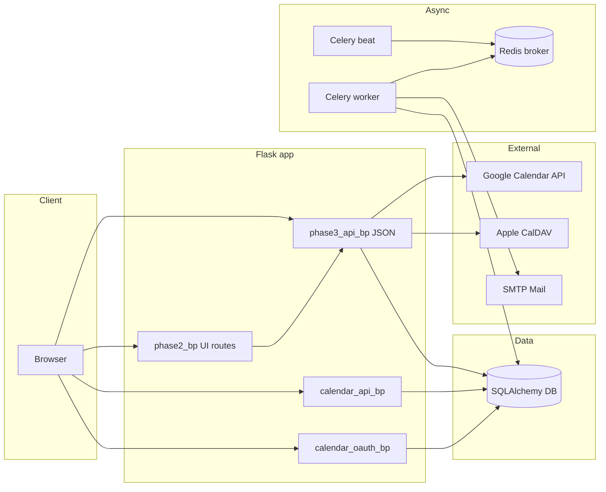

# Phase 3: Student learning — technical guide

This document describes the **Phase 3** student learning features: JSON APIs, background jobs, calendar integration, and the thin HTML surfaces that call them. It is the authoritative map to the code under `app/routes/phase3_routes.py`, related services, and operational setup.

## Scope

| Layer | Prefix / location | Primary module |
|--------|-------------------|----------------|
| Phase 3 REST API | `/api/phase3/*` | [`app/routes/phase3_routes.py`](../app/routes/phase3_routes.py) |
| Calendar connection API | `/api/calendar/*` | [`app/routes/calendar_api_routes.py`](../app/routes/calendar_api_routes.py) |
| Google Calendar OAuth | `/auth/calendar/*` | [`app/routes/calendar_oauth_routes.py`](../app/routes/calendar_oauth_routes.py) |
| Credential storage & encryption | — | [`app/services/calendar_connection_service.py`](../app/services/calendar_connection_service.py) |
| Push study plan to external calendars | — | [`app/services/phase3/calendar_sync_service.py`](../app/services/phase3/calendar_sync_service.py) |
| Student / teacher HTML (Phase 3 pages) | `/student-learning/*`, etc. | [`app/routes/phase2_routes.py`](../app/routes/phase2_routes.py) |
| Data models | — | [`app/models/phase3_models.py`](../app/models/phase3_models.py) |

Phase 3 builds on Phase 1 syllabus/exam types (foreign keys from Phase 3 entities). Teacher roster quiz scores are computed in [`app/services/phase3/teacher_roster_service.py`](../app/services/phase3/teacher_roster_service.py) and exposed via canonical teacher APIs (see [Teacher roster scores](#teacher-roster-scores)).

---

## Architecture



- **Browser** loads Jinja templates (e.g. [`templates/student_learning_hub.html`](../templates/student_learning_hub.html)) which call `/api/phase3/*` with session cookies.
- **Celery** runs tasks registered in [`app/celery_app.py`](../app/celery_app.py): OCR uploads (`phase3_tasks`), study-plan email reminders (`reminder_tasks`). **Both a worker and Celery Beat** are required for scheduled reminders.
- **Calendar sync** uses stored OAuth refresh tokens (Google) or CalDAV credentials (Apple), encrypted via [`app/utils/encryption.py`](../app/utils/encryption.py) patterns used in `calendar_connection_service`.

---

## Setup and operations

### Python dependencies

Install from [`requirements.txt`](../requirements.txt) in your virtual environment.

Phase 3–relevant packages include:

| Package | Role |
|---------|------|
| `google-api-python-client` | Google Calendar API (`calendar_sync_service`) |
| `google-auth`, `google-auth-oauthlib` | OAuth token refresh for Google |
| `caldav` | Apple iCloud CalDAV sync |
| `celery`, `redis` | Background tasks and broker |
| `Flask-Mail` | Reminder emails (and other app mail) |
| `SQLAlchemy` | ORM |

### Environment variables

**Celery** (defaults in [`app/config.py`](../app/config.py)):

| Variable | Purpose | Typical default |
|----------|---------|-----------------|
| `CELERY_BROKER_URL` | Message broker | `redis://localhost:6379/0` |
| `CELERY_RESULT_BACKEND` | Result backend | `redis://localhost:6379/0` |

**Google Calendar OAuth** (server must match Google Cloud Console app settings):

| Variable | Purpose |
|----------|---------|
| `GOOGLE_CALENDAR_CLIENT_ID` | OAuth client ID |
| `GOOGLE_CALENDAR_CLIENT_SECRET` | OAuth client secret |
| `GOOGLE_CALENDAR_REDIRECT_URI` | Optional override; else derived from `SERVER_URL` or Flask `url_for` |

**Email (Flask-Mail)** — reminders use the same mail stack as the rest of the app:

| Variable | Purpose |
|----------|---------|
| `MAIL_USERNAME` | SMTP user |
| `MAIL_PASSWORD` | SMTP password |
| Other `MAIL_*` | See `Config` in [`app/config.py`](../app/config.py) (`MAIL_SERVER`, `MAIL_PORT`, `MAIL_USE_SSL`, etc.) |

**SMS reminders (optional)** — used only when `reminder_channels.sms` is true and Twilio env is set:

| Variable | Purpose |
|----------|---------|
| `TWILIO_ACCOUNT_SID` | Twilio account |
| `TWILIO_AUTH_TOKEN` | Twilio auth |
| `TWILIO_FROM_NUMBER` | Sender number |
| `REMINDER_TEST_SMS_TO` | Destination number (current implementation sends to this test destination) |

If Twilio is not configured, SMS path logs a stub message instead of sending.

### Database

- On startup, [`init_db`](../app/utils/db.py) runs `Base.metadata.create_all` (after importing models including [`phase3_models`](../app/models/phase3_models.py)).
- `SKIP_DB_INIT=true` skips initialization (used in some tests/scripts).
- Incremental **ALTER** migrations in `init_db` add columns such as:
  - `user_calendar_connections.sync_meta_json` — maps stable plan-day UIDs to remote Google event IDs or CalDAV hrefs.
  - `student_learning_preferences.reminder_state_json` — deduplicates daily digest sends.

Tables for group study (`group_study_slots`, `group_study_rsvps`) are created via SQLAlchemy metadata when missing.

### Running Celery

From the application root (with `PYTHONPATH` / working directory set so `app` imports resolve, same as your existing Celery usage):

1. **Worker** (processes tasks):

   ```bash
   celery -A app.celery_app.celery worker -l info
   ```

2. **Beat** (schedules periodic tasks — **required** for study-plan email reminders):

   ```bash
   celery -A app.celery_app.celery beat -l info
   ```

The beat schedule is defined in [`app/celery_app.py`](../app/celery_app.py): task name `phase3.study_plan_reminders` runs on `crontab(minute="*/30")` (every 30 minutes). The task implementation is [`app/tasks/reminder_tasks.py`](../app/tasks/reminder_tasks.py).

### Running the web app

Use your existing entrypoint (e.g. `flask run`, `gunicorn`, or project-specific scripts documented in [`DEVELOPER_QUICK_START.md`](../DEVELOPER_QUICK_START.md)). Phase 3 requires a logged-in session for all `/api/phase3/*` routes that use `@student_required`, `@teacher_required`, or `@login_required`.

---

## API reference (`/api/phase3`)

Base URL prefix: **`/api/phase3`**. Unless noted, requests expect `Content-Type: application/json` for POST/PUT bodies.

Authentication is session-based (`login_required` family). Decorators used in code:

- **`@student_required`** — student role (and equivalent gates).
- **`@teacher_required`** — teacher role.
- **`@login_required`** — any authenticated user (often combined with role checks in handler).

### Question bank

| Method | Path | Auth | Description |
|--------|------|------|-------------|
| GET | `/question-bank/items` | login | List items (`syllabus_topic_id` query optional). |
| POST | `/question-bank/items` | teacher/admin | Create item (`stem`, `difficulty`, `bloom_level`, …). |
| PATCH | `/question-bank/items/<id>` | teacher/admin | Update fields. |
| DELETE | `/question-bank/items/<id>` | teacher/admin | Soft-delete (`is_active`). |
| POST | `/question-bank/items/bulk` | teacher/admin | Bulk CSV: raw CSV body or JSON `{"csv": "..."}`. Columns: `stem`, `difficulty`, `bloom_level`, `syllabus_topic_id`, `tags` (pipe-separated). |

Service: [`question_bank_service`](../app/services/phase3/question_bank_service.py). Admin UI: [`templates/admin/question_bank.html`](../templates/admin/question_bank.html).

### Learning events

| Method | Path | Auth | Description |
|--------|------|------|-------------|
| POST | `/events/batch` | student | Batch record client events. |

### Highlights and flashcards

| Method | Path | Auth | Description |
|--------|------|------|-------------|
| GET/POST | `/highlights` | student | List / create content highlights. |
| GET/POST | `/flashcards` | student | List / create flashcards. |
| POST | `/flashcards/<fc_id>/review` | student | SRS-style review (`quality`). |
| POST | `/flashcards/from-highlight` | student | Create card from highlight. |

### Progress

| Method | Path | Auth | Description |
|--------|------|------|-------------|
| POST | `/progress` | student | Save lecture/self-study position for a lesson. |
| GET | `/progress` | student | List recent progress rows. |

### Preferences and reminders

| Method | Path | Auth | Description |
|--------|------|------|-------------|
| GET | `/preferences` | student | Read prefs (`allow_teacher_view_self_study`, `reminder_channels`, `daily_goal_minutes`, `streak_days`). |
| PUT | `/preferences` | student | Update prefs; `reminder_channels` JSON may include `email`, `sms`, `push`. |

Email digests are sent by Celery when `reminder_channels.email` is true and today’s plan has blocks matching today’s date in `StudentStudyPlan.plan_json`. Dedup uses `reminder_state_json`.

### Exam targets

| Method | Path | Auth | Description |
|--------|------|------|-------------|
| POST | `/exam-target` | student | Create target (`exam_date`, optional `exam_type_id`, `label`). |
| GET | `/exam-targets` | student | List upcoming targets. |

### Study plans

| Method | Path | Auth | Description |
|--------|------|------|-------------|
| POST | `/study-plans/generate` | student | Skeleton plan from syllabus inputs. |
| POST | `/study-plans/conversational` | student | Conversational plan (LLM-assisted). |

### Ratings, diagnostic, adaptation

| Method | Path | Auth | Description |
|--------|------|------|-------------|
| POST | `/ratings` | student | Star rating for a lesson. |
| POST | `/diagnostic` | student | Update diagnostic profile / baseline. |
| GET | `/diagnostic/profile` | student | Read diagnostic profile. |
| POST | `/diagnostic/session` | student | Next adaptive question from bank. |
| POST | `/adaptation` | student | Log teaching adaptation event. |

### Adherence

| Method | Path | Auth | Description |
|--------|------|------|-------------|
| POST | `/adherence` | student | Log planned/actual minutes or missed flag for a day. |
| GET | `/adherence/history` | student | Recent adherence rows. |

### Dashboard and cohort

| Method | Path | Auth | Description |
|--------|------|------|-------------|
| GET | `/dashboard-summary` | student | Streak, goal, exam countdown, latest plan preview, flashcard count. |
| GET | `/class-comparison` | student | Positive-framed cohort metrics (`class_section_id` query required). |

### Teacher flows

| Method | Path | Auth | Description |
|--------|------|------|-------------|
| POST | `/teacher/review` | teacher | Save next-day reflection linked to lesson. |
| POST | `/teacher/mini-lecture/targets` | teacher | Target students for mini-lecture. |
| GET | `/teacher/lessons/<lesson_id>/student-questions` | teacher | Student questions for lesson. |

### Uploads and prep books

| Method | Path | Auth | Description |
|--------|------|------|-------------|
| GET | `/uploads` | student | List uploads (metadata only in JSON). |
| POST | `/uploads` | student | Multipart upload (`file`, `category`: `prep_book` or `content_book`). Triggers OCR task when Celery available. |
| POST | `/prep-books/<upload_id>/analyze-topics` | student | Topic extraction from OCR text. |

### Calendar (Phase 3)

| Method | Path | Auth | Description |
|--------|------|------|-------------|
| GET | `/calendar/export.ics` | student | Download ICS from latest study plan. |
| POST | `/calendar/sync` | student | Push latest plan days to connected Google and/or Apple calendars. |

Connections are managed via **`/api/calendar`** and **`/auth/calendar/google/*`** (see below).

### Real-world snippets

| Method | Path | Auth | Description |
|--------|------|------|-------------|
| GET | `/realworld/<syllabus_topic_id>` | login | Snippet payload for topic. |

### Group study

| Method | Path | Auth | Description |
|--------|------|------|-------------|
| GET / POST | `/teacher/group-study/slots` | teacher | List or create slot (`lesson_id`, `title`, `starts_at`, `ends_at`, `max_students`, `notes`). |
| DELETE | `/teacher/group-study/slots/<slot_id>` | teacher | Cancel slot. |
| GET | `/group-study/slots` | student | List upcoming slots the student may join. |
| POST / DELETE | `/group-study/slots/<slot_id>/rsvp` | student | RSVP or cancel RSVP. |

Service: [`group_study_service`](../app/services/phase3/group_study_service.py). Eligibility ties lessons to sections via `LectureClassSection` and enrollments.

---

## Calendar connection APIs (outside `/api/phase3`)

| Method | Path | Auth | Description |
|--------|------|------|-------------|
| GET | `/api/calendar/connections` | login | List connected providers (no secrets). |
| POST | `/api/calendar/connections/apple` | login | Save Apple ID + app-specific password (CalDAV). |
| DELETE | `/api/calendar/connections/<provider>` | login | Remove connection. |

| Method | Path | Auth | Description |
|--------|------|------|-------------|
| GET | `/auth/calendar/google/start` | login | Start Google OAuth (offline access). |
| GET | `/auth/calendar/google/callback` | login | OAuth callback; stores encrypted refresh token. |

---

## Student and teacher UI routes (HTML)

These are registered on the **default Flask blueprint** (no URL prefix) in [`phase2_routes.py`](../app/routes/phase2_routes.py). All require `@login_required`; student Phase 3 pages also require student role (or super-admin), via `_require_student_or_super()`.

| URL | Template | Notes |
|-----|----------|--------|
| `/student-learning` | `student_learning_hub.html` | Hub: summary, calendar connect, **Sync now**, links to sub-pages. |
| `/student-learning/flashcards` | `student_learning_flashcards.html` | Uses flashcard APIs. |
| `/student-learning/diagnostic` | `student_learning_diagnostic.html` | Adaptive diagnostic session. |
| `/student-learning/preferences` | `student_learning_preferences.html` | GET/PUT `/preferences`. |
| `/student-learning/adherence` | `student_learning_adherence.html` | Adherence log + history. |
| `/student-learning/exam-targets` | `student_learning_exam_targets.html` | Exam targets list/create. |
| `/student-learning/uploads` | `student_learning_uploads.html` | List + multipart upload. |
| `/student-learning/group-study` | `student_learning_group_study.html` | RSVP to teacher slots. |
| `/lecture-reader/<lesson_id>` | `lecture_reader.html` | Reader with Phase 3 panels. |
| `/next-day-review` | `next_day_review.html` | Teacher: includes **Schedule group study** modal → teacher group-study API. |

---

## Teacher roster scores

Roster entries for a teacher’s enrolled students are built in [`teacher_roster_service.list_teacher_students`](../app/services/phase3/teacher_roster_service.py):

- **`score`**: ratio of sum of quiz scores to sum of max scores across `QuizSubmission` rows for quiz sessions owned by that teacher (nullable if no quizzes).
- **`quiz_avg_percent`**: `score * 100` when `score` is present.

Consumed by canonical APIs — see imports of `list_teacher_students` in [`app/routes/canonical_api.py`](../app/routes/canonical_api.py).

---

## Operational limitations

1. **Google Calendar sync** requires valid OAuth client env vars, user consent, and outbound HTTPS to Google APIs.
2. **Apple CalDAV** requires the `caldav` package, correct iCloud host and app-specific password; network access to Apple’s servers.
3. **Email reminders** require working Flask-Mail/SMTP configuration and Celery **worker + beat** running.
4. **SMS** sends only when Twilio env vars and `REMINDER_TEST_SMS_TO` are set; otherwise behavior is log-only.
5. **Push** notifications in reminders are stubbed (logged) until a push provider is integrated.

---

## Related files quick index

| Concern | File |
|---------|------|
| All Phase 3 HTTP routes | [`app/routes/phase3_routes.py`](../app/routes/phase3_routes.py) |
| Celery app & beat schedule | [`app/celery_app.py`](../app/celery_app.py) |
| Study-plan reminder task | [`app/tasks/reminder_tasks.py`](../app/tasks/reminder_tasks.py) |
| OCR / phase3 fan-out tasks | [`app/tasks/phase3_tasks.py`](../app/tasks/phase3_tasks.py) |
| Calendar push sync | [`app/services/phase3/calendar_sync_service.py`](../app/services/phase3/calendar_sync_service.py) |
| Group study logic | [`app/services/phase3/group_study_service.py`](../app/services/phase3/group_study_service.py) |
| Phase 3 ORM models | [`app/models/phase3_models.py`](../app/models/phase3_models.py) |
| DB init & migrations | [`app/utils/db.py`](../app/utils/db.py) |

For end-user-facing wording, you may also cross-link [`docs/User_Guide.md`](User_Guide.md) if relevant sections exist there.
