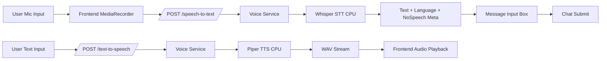

# Multilingual Voice System Research and Implementation

## Goals

- Fully open-source STT + TTS stack
- CPU-efficient for low-resource deployments
- Multilingual support with Urdu focus
- Real-time or near real-time usability
- Easy integration for Python/Node APIs

## STT Research (Open Source)

### 1) Faster-Whisper (Recommended STT Backbone)
- Repo: [SYSTRAN/faster-whisper](https://github.com/SYSTRAN/faster-whisper)
- Why: CTranslate2-based Whisper inference is significantly faster and lighter than reference Whisper, while preserving multilingual robustness.
- Urdu: Strong practical support through Whisper multilingual training.
- CPU notes: Use `small`/`base` models for low-latency CPU workloads; quantized inference improves throughput.
- Trade-off: `base` is faster but less accurate than `small`/`medium`.

### 2) Whisper (Current Codebase Integration)
- Repo: [openai/whisper](https://github.com/openai/whisper)
- Why: Stable multilingual baseline with good Urdu handling.
- CPU notes: Slower than Faster-Whisper but very easy to integrate.
- Trade-off: Better quality with larger models, but latency increases sharply on CPU.

### 3) Vosk (Ultra-Light Offline Option)
- Repo: [alphacep/vosk-api](https://github.com/alphacep/vosk-api)
- Why: Very light, streaming-friendly offline speech recognition.
- CPU notes: Excellent for edge devices and low-RAM servers.
- Trade-off: Accuracy for Urdu and mixed-language utterances is usually below Whisper-family models.

## TTS Research (Open Source)

### 1) Piper TTS (Recommended TTS Backbone)
- Repo: [rhasspy/piper](https://github.com/rhasspy/piper)
- Why: Local, lightweight ONNX inference with strong CPU performance.
- CPU notes: Suitable for near real-time synthesis on commodity CPUs.
- Urdu: Requires an Urdu-compatible Piper voice model installed on server.
- Trade-off: Voice quality depends on available community model quality.

### 2) Coqui TTS / XTTS
- Repo: [coqui-ai/TTS](https://github.com/coqui-ai/TTS)
- Why: Rich multilingual/voice-cloning ecosystem.
- CPU notes: Often too heavy for real-time CPU-only production.
- Trade-off: Higher capability, higher infra cost.

### 3) MMS-TTS (Meta, model ecosystem)
- Repo: [facebookresearch/fairseq](https://github.com/facebookresearch/fairseq)
- Why: Broad language coverage.
- CPU notes: Can run on CPU but integration complexity is higher than Piper.
- Trade-off: More setup and tuning effort for production.

## Noise/Silence Handling Research

### Recommended pre-STT gate
- Silero VAD repo: [snakers4/silero-vad](https://github.com/snakers4/silero-vad)
- Use for robust speech detection before transcription to avoid wasted STT cycles and false triggers.
- Current implementation uses Whisper no-speech probability for fail-safe behavior; Silero VAD can be added next for stronger front-end filtering.

### Practical implementation chosen for this codebase
- WebRTC VAD repo: [wiseman/py-webrtcvad](https://github.com/wiseman/py-webrtcvad)
- Why selected now:
  - Very lightweight and CPU-efficient
  - Easy Python integration without external model download
  - Proven in real-time voice pipelines
- Implemented behavior:
  - Server-side VAD gate runs before Whisper STT
  - Rejects low-energy/noise-only clips with `NO_SPEECH`
  - Uses frame-based speech ratio and minimum continuous speech duration
  - Combined with frontend auto-stop-on-silence for natural turn ending

## Recommended Production Stack

- STT: Whisper/Faster-Whisper (`base` or `small`) CPU mode
- TTS: Piper with per-language voice model mapping
- Optional VAD: Silero VAD (CPU)
- API: Flask endpoints for `/speech-to-text` and `/text-to-speech`
- Frontend: MediaRecorder for mic capture, Audio playback for generated WAV

## Implemented Architecture

## UX Flow (Implemented)

1. User taps mic button.
2. Browser records speech.
3. Audio sent to `/speech-to-text` with selected language (`auto`, `ur`, `ur-Latn`, `en`, `hi`).
4. Backend returns transcribed text and metadata.
5. Text auto-fills chat input for user confirmation/edit.
6. User sends message as normal.
7. User taps speaker button to read latest assistant answer via `/text-to-speech`.
8. Audio plays locally; toggle supports immediate stop.

## API Contract (Implemented)

### `POST /speech-to-text`
- Form-data:
  - `audio`: recorded blob
  - `language` (optional): `auto|ur|ur-Latn|en|hi`
- Success:
  - `text`, `language`, `meta.avg_no_speech_prob`
- Errors:
  - `AUDIO_REQUIRED`, `AUDIO_TOO_SHORT`, `NO_SPEECH`, `STT_FAILED`

### `POST /text-to-speech`
- JSON:
  - `text`
  - `language` (optional): `auto|ur|ur-Latn|en|hi`
- Success:
  - WAV audio stream
- Errors:
  - `TEXT_REQUIRED`, `VOICE_MODEL_MISSING`, `TTS_FAILED`

## CPU Optimization Tips

- Keep STT model at `base` for low-latency interaction; move to `small` only when needed.
- Warm-load models once per worker to avoid cold-start delays.
- Limit incoming audio duration (e.g., 15-30s max) for bounded latency.
- Use language hint when known to reduce STT search space and improve speed.
- Enable request timeouts and fallback error payloads to keep UI responsive.
- For high traffic, run STT/TTS in a worker queue and stream status to UI.

## Required Runtime Configuration

Set voice model paths via environment variables as needed:

- `PIPER_EN_MODEL_PATH` (default: `piper_models/en_US-lessac-medium.onnx`)
- `PIPER_UR_MODEL_PATH` (default: `piper_models/ur_PK-fasih-medium.onnx`)
- `PIPER_HI_MODEL_PATH` (default: `piper_models/hi_IN-rohan-medium.onnx`)

Install voices with `bash scripts/download_piper_models.sh` (see `docs/piper_models_setup.md`). Without local `.onnx` files, the app falls back to gTTS where possible.
