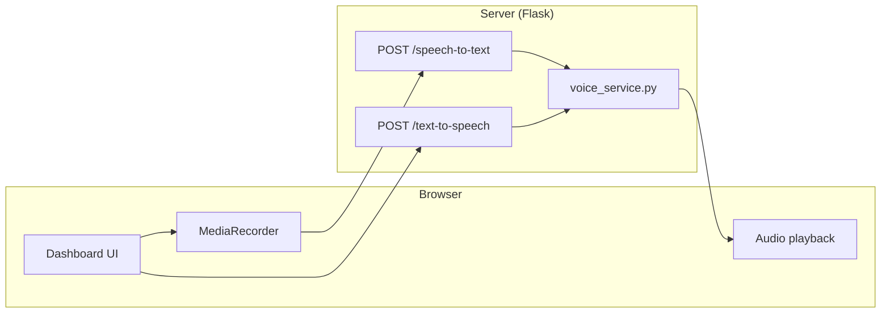

# Multilingual Voice System — Implementation Summary (Executive Brief)

This document explains **what was built**, **why it matters for the product**, **which techniques and open components we used**, **which files implement it**, and **how the end-to-end flow works**. It is written for **non-engineering leadership** as well as technical stakeholders who need a single reference.

---

## 1. Executive summary

We implemented a **production-oriented, server-side voice stack** so teachers and students can **speak to the assistant**, **hear answers read aloud**, and use a **hands-free “conversation mode”** (listen → transcribe → send → speak response → listen again), with **Urdu and English** as first-class use cases.

**Strategic choices:**

- **Open-source, CPU-friendly stack** — runs on typical servers without requiring paid speech APIs or a GPU.
- **Consistent UX in the browser** — same HTTP APIs for **teacher** and **student** dashboards; quality does not depend on fragile browser speech APIs for Urdu.
- **Operational resilience** — optional **WebRTC VAD** gating and Whisper **confidence-style checks** reduce false triggers from background noise; **Piper TTS** with **gTTS fallback** when local voice models are missing.

---

## 2. User-visible features

| Feature | What the user experiences |
|--------|---------------------------|
| **Push-to-talk / auto-turn voice input** | User speaks; audio is recorded in the browser and sent to the server for transcription. |
| **Conversation mode** | One control turns on a loop: **listen → transcribe → send message → play AI reply → listen again** until the user turns it off. |
| **Interrupt while AI speaks (“barge-in”)** | While the assistant is reading a reply, the user can **speak over** the playback so the system stops TTS and starts listening again (with tunable sensitivity for quiet vs noisy rooms). |
| **Manual interrupt (press-and-hold)** | Optional **hold** on the conversation control to force interrupt when automatic detection is harder (e.g. noisy environment). |
| **Noise handling (“hybrid” mode)** | User can choose a **Quiet** vs **Noisy** profile to tune how aggressive interruption / VAD behavior feels. |
| **Language selection (English / Urdu)** | UI language for speech is constrained to **English** and **Urdu** (with sensible server-side handling for script and Roman Urdu hints where applicable). |
| **Cleaner spoken output** | Server strips **emoji, markdown, URLs**, and other artifacts so TTS does not read “syntax noise.” |
| **Student + teacher parity** | The **same backend voice pipeline** is wired into **`teacher_dashboard.html`** and **`student_dashboard.html`**. |
| **Lesson PDF (RAG) approval flow** | When the lesson Q&A path asks the user to approve searching the teacher PDF, **approving “Yes”** still **keeps conversation mode alive** and resumes **TTS + listening** after the answer returns (previously that path updated the UI without re-entering the voice loop). |

---

## 3. Architecture (how it fits together)

At a high level:

1. **Browser** captures short audio with the **Web `MediaRecorder` API**, uploads it as `multipart/form-data`.
2. **Flask** receives audio on **`POST /speech-to-text`**, runs **VAD + Whisper**, returns JSON text.
3. For replies, the browser calls **`POST /text-to-speech`** with plain text; the server returns **audio/wav** (Piper) or **audio/mpeg** (gTTS fallback) and the browser plays it via **`HTMLAudioElement`**.
4. **Conversation mode** orchestrates these calls in JavaScript: after each assistant message (including special flows like **RAG confirmation**), the client **speaks** then **starts listening** again unless the user explicitly turns conversation mode off.

---

## 4. Techniques and technologies used

### Speech-to-text (STT)

- **OpenAI Whisper (local, `openai-whisper` package)** — **`base` model on CPU** for predictable deployment cost and privacy-friendly on-prem processing.
- **WebRTC Voice Activity Detection (`webrtcvad`)** — optional **pre-gate** so obvious silence / low-energy / non-speech clips are rejected **before** Whisper runs (reduces junk transcriptions and server load). If the native module is unavailable, the service **degrades gracefully** (skips strict VAD rather than crashing).
- **Whisper segment metadata** — uses aggregated **`no_speech_prob`** as an additional **“no clear speech”** safeguard after decoding.

### Text-to-speech (TTS)

- **Piper (`piper-tts`)** — primary **local neural TTS**; outputs WAV; **no GPU required** in our integration path.
- **Google Text-to-Speech via `gTTS`** — **fallback** when Piper model files are missing or Piper fails to load, so the product **still speaks** in Urdu/Hindi/English where supported by the fallback.
- **`langdetect`** — assists **language routing** for TTS when the UI hint is “auto,” with special handling for **Urdu script** vs Roman text.

### Text hygiene (TTS quality)

- **Unicode normalization** and **regex-based cleaning** remove markdown, code fences, URLs, emoji blocks, and noisy punctuation before synthesis — this directly improves **perceived quality** and avoids embarrassing readouts.

### Front-end UX techniques

- **`MediaRecorder`** for compressed audio (e.g. **webm**) with `FormData` upload.
- **`AudioContext` + `AnalyserNode`** for **RMS-based barge-in** while TTS plays (separate “monitor” stream), with **different thresholds** for quiet vs noisy modes.
- **Press-and-hold timer** on the conversation control for **manual interrupt** when environmental noise makes automatic barge-in harder.
- **Single-flight / state flags** in the dashboard scripts to avoid overlapping TTS, duplicate recordings, and “stacked” audio when users tap quickly.

---

## 5. HTTP API surface (canonical + legacy)

| Method | Path | Purpose |
|--------|------|---------|
| `POST` | `/speech-to-text` | Upload audio (`audio` file field) + optional `language`; returns JSON `text`. |
| `POST` | `/text-to-speech` | JSON body `{ "text": "...", "language": "en" \| "ur" \| "auto" ... }`; returns audio bytes. |
| `POST` | `/api/stt` | Legacy alias → same implementation as `/speech-to-text`. |
| `POST` | `/api/tts` | Legacy alias → same implementation as `/text-to-speech`. |

Responses are designed for **simple client integration**: STT is JSON; TTS is a **binary audio stream** with MIME type aligned to the engine output (**WAV vs MP3**).

---

## 6. Primary files touched (implementation map)

These are the **main** files that implement the voice feature end-to-end:

| File | Role |
|------|------|
| `iqbal_ai_stg/app/services/voice_service.py` | **Core voice engine**: VAD gate, Whisper transcription, Piper synthesis, gTTS fallback, text cleaning, language normalization. |
| `iqbal_ai_stg/app/routes/chat.py` | **HTTP endpoints**: `/speech-to-text`, `/text-to-speech`, plus legacy `/api/stt` and `/api/tts`; wires requests into `voice_service`. |
| `iqbal_ai_stg/templates/teacher_dashboard.html` | **Teacher UI**: conversation mode, STT/TTS calls, barge-in, noise mode, manual interrupt, status UX. |
| `iqbal_ai_stg/templates/student_dashboard.html` | **Student UI**: same backend conversation stack; includes **RAG PDF confirmation** paths wired back into the voice loop via `resumeConversationAfterAssistantPlain`. |
| `iqbal_ai_stg/requirements.txt` | Declares **`openai-whisper`**, **`piper-tts`**, **`webrtcvad`** (and the rest of the app’s dependencies). |
| `iqbal_ai_stg/docs/multilingual_voice_system_research.md` | Deeper **research / rationale / architecture notes** (companion to this executive summary). |

**Related (secondary) reference:**

| File | Role |
|------|------|
| `iqbal_ai_stg/app/utils/whisper_stt.py` | Separate **lazy-loaded Whisper helper** used by some **RAG / audio** server paths (not the main dashboard STT service, which is centralized in `voice_service.py`). |

---

## 7. Configuration and operations (what leadership should know)

- **Piper models** are resolved via environment variables **or sensible default paths** under `piper_models/` (see `_voice_model_path_for_lang` in `voice_service.py`). If models are absent, the system **falls back to gTTS** where possible instead of failing silently from a user perspective.
- **`webrtcvad`** may require **`setuptools`** in the deployment environment (transitive dependency expectations). The code **guards import failure** so the app still runs; only the **strict VAD precheck** is skipped if the module cannot load.
- **CPU inference** is intentional: predictable cost, simpler infrastructure, aligns with “open stack on commodity hardware.”

---

## 8. Implementation narrative (plain-language “how we built it”)

1. **We centralized voice logic in Python** (`voice_service.py`) so every UI uses the same behavior for cleaning text, choosing TTS language, running Whisper, and returning audio in a consistent way.
2. **We exposed clean REST endpoints** in `chat.py` so the browser does not need vendor-specific SDKs for STT/TTS.
3. **We replaced dependence on browser-native Urdu speech** (often inconsistent) with **server-generated speech**, improving parity across devices.
4. **We implemented conversation mode in the dashboard templates** by orchestrating: record → STT → send chat/lesson API → on assistant text → TTS → resume recording, with explicit state to prevent overlapping playback.
5. **We added barge-in** by measuring microphone energy while audio plays and stopping TTS when sustained speech is detected, with separate tuning for noisy environments.
6. **We fixed edge flows** such as **lesson PDF (RAG) confirmation** on the student dashboard so that **custom DOM updates** still trigger the same “speak then listen again” pipeline used by normal assistant messages.

---

## 9. Suggested talking points for product / GTM

- **Accessibility and learning outcomes**: voice lowers friction for younger students, language learners, and users who struggle with typing.
- **Urdu-first positioning**: server-side TTS/STT avoids browser limitations and makes demos reliable.
- **Cost control**: local CPU inference reduces recurring API bills versus cloud-only speech stacks.
- **Trust and compliance posture** (high level): audio is processed by **our stack** (on-prem / our cloud) rather than shipping raw voice to a third-party STT vendor—exact deployment depends on hosting choices.

---

## Document control

- **Purpose**: Executive + cross-team summary of the shipped voice system.
- **Companion detail doc**: `multilingual_voice_system_research.md`
- **Scope**: Describes the intended implementation in the `iqbal_ai_stg` codebase; deployment-specific URLs, environments, and model bundles should be documented separately by DevOps.
